# Believers Sword

<div align="center">

**A cross-platform Bible study companion for reading, prayer, notes, highlights, and daily devotion.**

[](https://github.com/polystrategist/bible-app/releases/latest)
[](https://www.electronjs.org/)
[](https://vuejs.org/)
[](./LICENSE)

[Releases](https://github.com/polystrategist/bible-app/releases/latest) · [Report an Issue](https://github.com/polystrategist/bible-app/issues) · [Contributing](#contributing)

</div>

> *"Your word is a lamp to my feet and a light to my path."* — Psalm 119:105

<div align="center">
  
</div>

## Table of Contents

- [About](#about)
- [Features](#features)
- [Screenshots](#screenshots)
- [Installation](#installation)
- [System Requirements](#system-requirements)
- [Development](#development)
- [Tech Stack](#tech-stack)
- [Contributing](#contributing)
- [Support the Project](#support-the-project)
- [License](#license)

## About

Believers Sword is a desktop Bible application designed to help believers stay close to Scripture throughout the day. It brings reading, study tools, personal notes, highlights, prayer tracking, and offline access together in a single, focused workspace.

The app is built with Electron and Vue 3, and is available for Windows, macOS, and Linux.

## Features

### Bible Reading & Study

- Read multiple Bible translations in a clean, distraction-free reader
- Search verses quickly across installed modules
- Compare translations side by side
- Access commentary resources while you study

### Notes & Organization

- Highlight verses and organize them by color
- Create notes and clip notes directly from Scripture
- Save bookmarks for quick return

### Prayer & Devotion

- Manage prayer lists and track answered prayers
- Listen with built-in audio and text-to-speech support

### Platform

- Work offline with locally stored Bible modules and resources
- Install via GitHub Releases or the Microsoft Store on Windows

## Screenshots

### Desktop

<div align="center">
  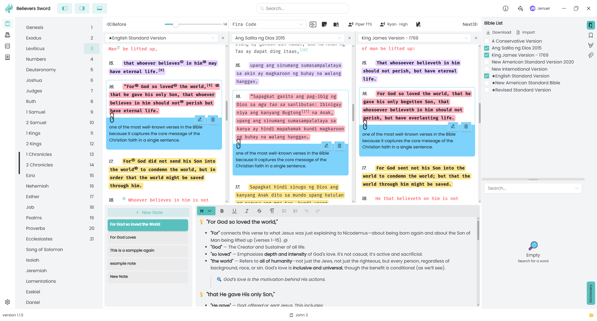
  
  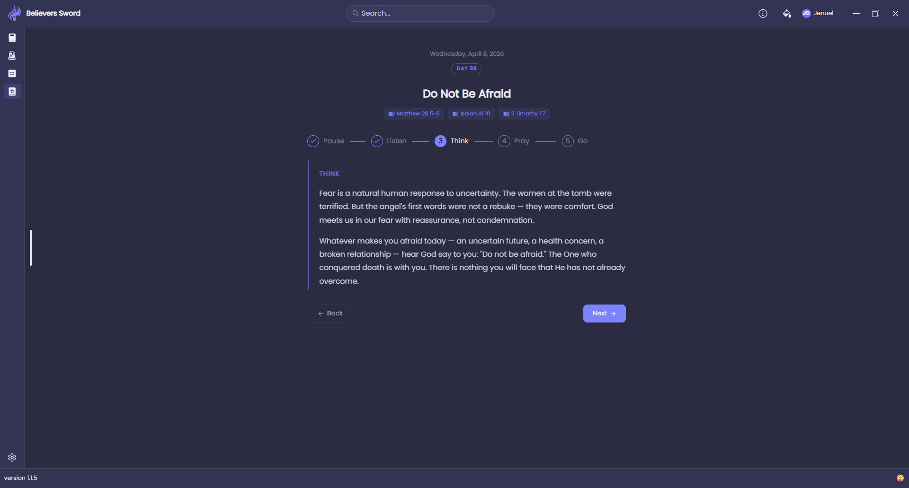
</div>

<div align="center">
  
  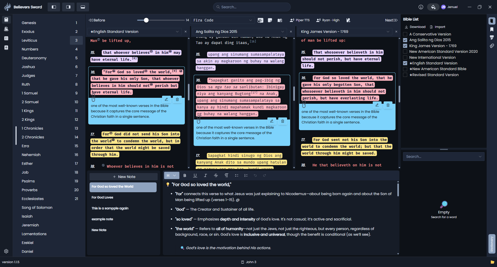
  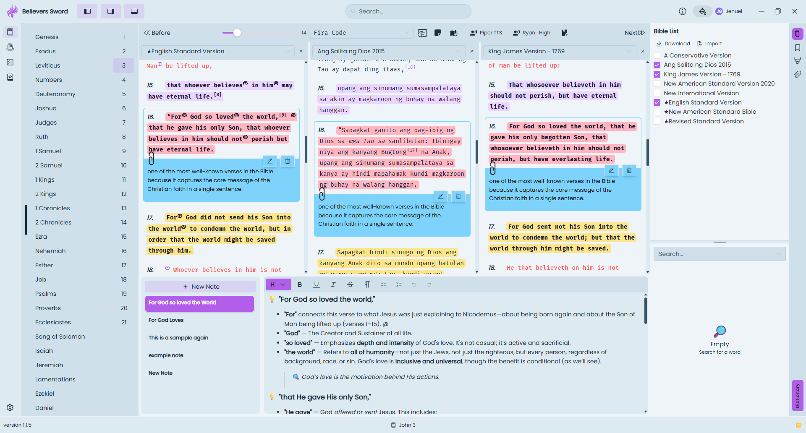
</div>

<div align="center">
  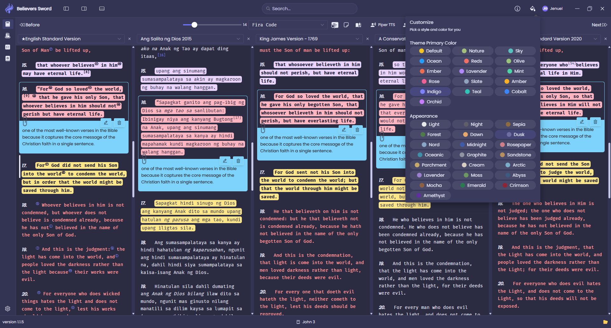
  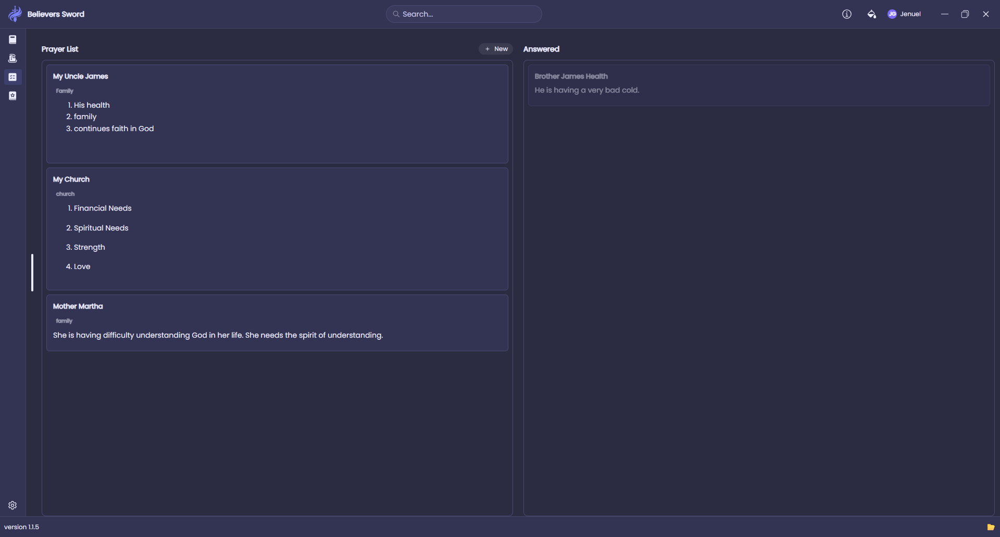
  
</div>

<div align="center">
  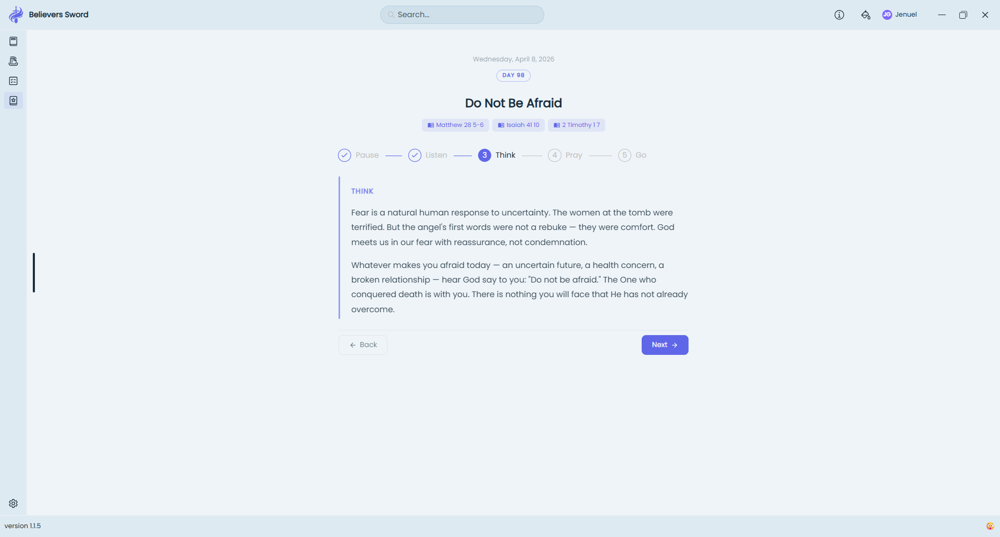
</div>

### Mobile

<div align="center">
  
  
  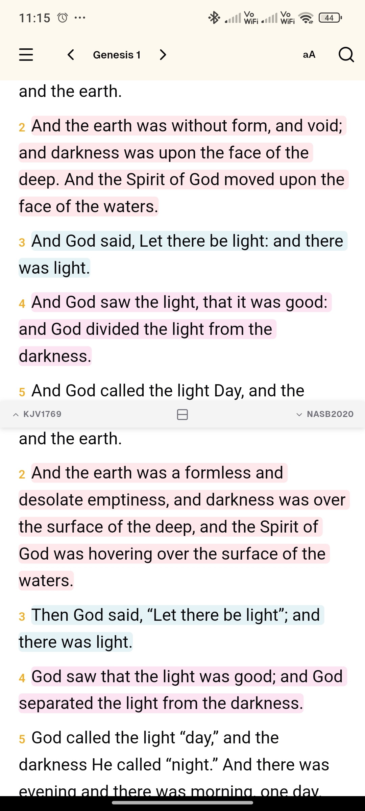
  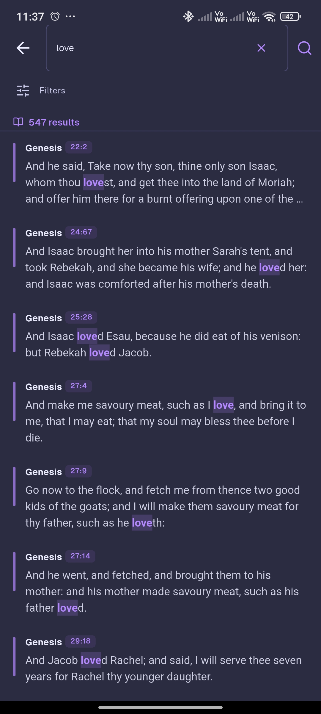
</div>

<div align="center">
  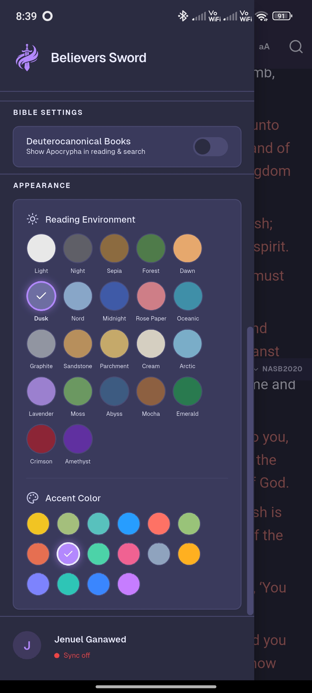
  
  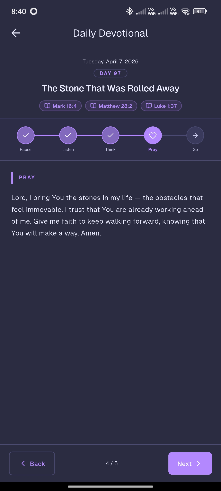
  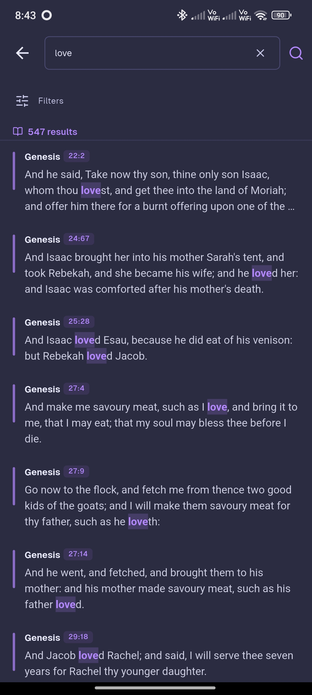
</div>

## Installation

Pre-built packages are published on [GitHub Releases](https://github.com/polystrategist/bible-app/releases/latest). Windows users can also install from the Microsoft Store.

| Platform | Format | Notes |
| --- | --- | --- |
| Windows | NSIS installer | Recommended for most users |
| Windows | Portable executable | No installation required |
| Windows | Microsoft Store | Store-managed updates |
| macOS | DMG | Available when published for a release |
| Linux | AppImage | Portable, distribution-independent |

Download the latest release for your platform from the [releases page](https://github.com/polystrategist/bible-app/releases/latest).

## System Requirements

| Requirement | Minimum |
| --- | --- |
| Operating system | Windows 10+, macOS (when published), or Linux |
| Memory | 2 GB RAM |
| Storage | ~500 MB free disk space |

## Development

### Prerequisites

- [Node.js](https://nodejs.org/) (LTS recommended)
- [Yarn](https://yarnpkg.com/)

### Getting Started

```bash
git clone https://github.com/polystrategist/bible-app.git
cd bible-app
yarn setup
yarn start
```

### Available Scripts

| Command | Description |
| --- | --- |
| `yarn setup` | Install root and frontend dependencies |
| `yarn start` | Run the app locally in development mode |
| `yarn app:build` | Build desktop packages for distribution |
| `yarn app:build:msix` | Build the Microsoft Store (MSIX) package |

## Tech Stack

| Layer | Technology |
| --- | --- |
| Desktop shell | [Electron](https://www.electronjs.org/) |
| Frontend | [Vue 3](https://vuejs.org/), [Vite](https://vitejs.dev/) |
| Local data | SQLite |
| Packaging | [electron-builder](https://www.electron.build/) |

## Contributing

Contributions are welcome. To propose a change:

1. Fork the [repository](https://github.com/polystrategist/bible-app).
2. Create a feature branch from `main`.
3. Make your changes with clear, focused commits.
4. Push your branch and open a pull request.

### Pull Request Labels

Add one of the following labels so changes are categorized correctly in release notes:

| Label | Use when |
| --- | --- |
| `feature` or `enhancement` | Adding new functionality |
| `bug` or `fix` | Fixing a defect |
| `improvement`, `refactor`, or `performance` | Improving existing code without new features |
| `documentation` or `docs` | Documentation-only changes |

If no label is added, the pull request appears under **Other Changes** in the release notes.

## Support the Project

If Believers Sword has been helpful and you would like to support ongoing development:

<div align="center">

[](https://buymeacoffee.com/jenuel.dev)

</div>

- [Buy Me a Coffee](https://buymeacoffee.com/jenuel.dev) — one-time donation
- [Membership](https://buymeacoffee.com/jenuel.dev/membership) — recurring support
- [GitHub Sponsors](https://github.com/sponsors/JenuelDev) — sponsor the maintainer

## License

This project is licensed under the [PolyForm Noncommercial License 1.0.0](./LICENSE). Noncommercial use is permitted; commercial use requires a separate license from the copyright holder.
